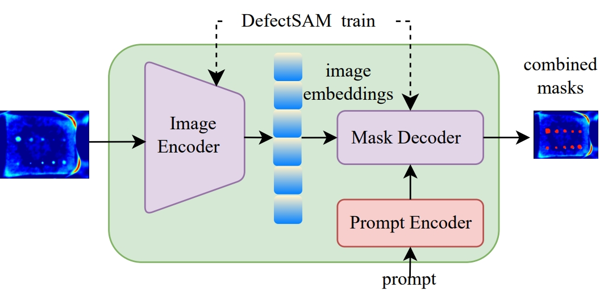

# DefectSAM
Segment Anything in Defect Detection, this is the official repository for DefectSAM.




## Installation
1. Install [Pytorch 2.0](https://pytorch.org/get-started/locally/), and torchvision.
2. Install Segment Anything:

```
pip install git+https://github.com/facebookresearch/segment-anything.git
```

or clone the repository locally and install with

```
git clone git@github.com:facebookresearch/segment-anything.git
cd segment-anything; pip install -e .
```


## Get Started
Download the [model checkpoint](https://drive.google.com/file/d/1VX8O7R7UCUg8In9SShLxK1lVRi97luEf/view?usp=sharing) and place it at e.g., `weights/defect_vit_b`

## Dataset
The history of the thermal data for flat-type specimens is [here](https://github.com/bozhenhhu/Deep-Learning-Models-for-Defect-Detection). We released more thermal data and artificial annotations in the Releases of this repository.

### License
Creative Commons Attribution-NonCommercial 4.0 International (CC BY-NC 4.0)


## Acknowledgements
- We highly appreciate all the challenge organizers and dataset owners for providing the public dataset to the community.
- We thank Meta AI for making the source code of [segment anything](https://github.com/facebookresearch/segment-anything) publicly available.
- We also thank Alexandre Bonnet for sharing this great [blog](https://encord.com/blog/learn-how-to-fine-tune-the-segment-anything-model-sam/)
- We highly thank Jun Ma, etc., for making the source code of MedSAM [paper](https://arxiv.org/abs/2304.12306), [code](https://github.com/bowang-lab/MedSAM)

## Reference
```
@misc{hu2023segment,
      title={Segment Anything in Defect Detection}, 
      author={Bozhen Hu and Bin Gao and Cheng Tan and Tongle Wu and Stan Z. Li},
      year={2023},
      eprint={2311.10245},
      archivePrefix={arXiv},
      primaryClass={cs.CV}
}
```
